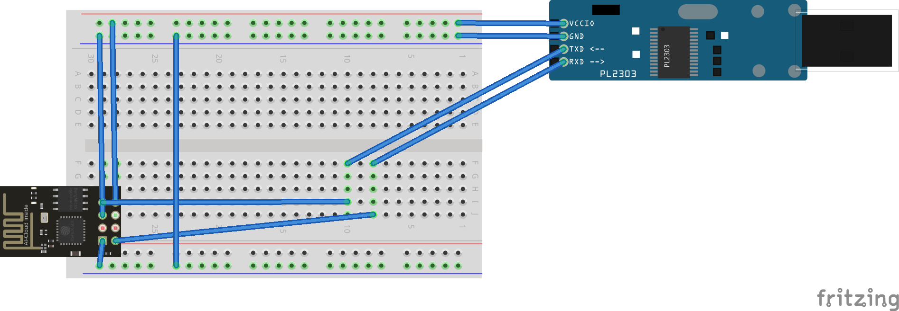

# Flash Mode

PL2303:RXD ↔ ESP01S:TXD

PL2303:TXD ↔ ESP01S:RXD

PL2303:VCC ↔ ESP01S:VCC

PL2303:GND ↔ ESP01S:GND

PL2303:GND ↔ ESP01S:IO00

# Work Mode

PL2303:VCC ↔ ESP01S:VCC

PL2303:GND ↔ ESP01S:GND

DHT11:DATA ↔ ESP01S:IO00

